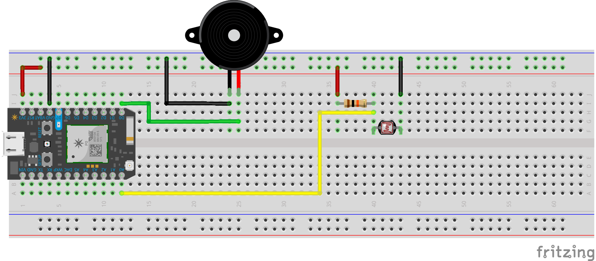

# Light Theremin

The following simple circuit creates a theremin with a frequency modulated by light exposure, allowing a musician to play the instrument by adjusting the amount of light that strikes a sensor. 



There are 3 components in play: a Piezo Buzzer, a Photoresistor, and a 10k Ohms pull down resistor.

### Piezo Buzzer


Relying on the principle of [Piezo electrostatic vibration](https://www.allaboutcircuits.com/technical-articles/how-piezoelectric-speakers-work/), a tiny crystal within this small cylinder is excited to vibrate based on a current of electricity. Depending on the frequency of the electric pulse running through the crystal, different vibrations produce different buzzing sounds. The `tone()` command in Arduino allows us to produce sound waves at a specific hertz from a Piezo buzzer. Hertz values can be referenced off of the more commonly known [Piano key names](https://en.wikipedia.org/wiki/Piano_key_frequencies).

### Photoresistor (or Light-Dependent Resistor)


This small *analog* sensor relys on the flexion that occurs when a lead-based metal alloy (wash your hands after touching it!) is exposed to light to minutely adjust its electrical resistance. The more light that strikes the [photoresistor](https://en.wikipedia.org/wiki/Photoresistor) and its characteristic wave-shaped *bandgap*, the more voltage can flow through the component. In the darkness, the component has a high resistance and prevents the flow of electrons from jumping the bandgap. Photoresistors are used in any object that need to reference the general intensity of light or shadow in a space, and are frequently used in for day-night behavior switching.


### Pull Down Resistor


The 10K Ohm resistor is used in combination with the Photoresistor to ensure that current flows through the sensor. Otherwise, power would not flow directly to ground through the sensor. Pull Up and Pull Down resistors are often used in this way, and will be discussed in future weeks.

-----

### Code
The Arduino code to drive this circuit is simple.

```c
//This code emulates the sound and interface of a theremin with a Photoresistor and a Piezo Buzzer.

//Pin Definitions : Piezo Buzzer on D0 and Photoresistor on A0
int speakerPin = D0;
int sensorPin = A0;
 
//In setup, code runs once
void setup(){
    //setup Serial communication so we can read from the Paricle over USB
    Serial.begin(9600);
	
	//Set the 'one-way-streets' so that the right pins are speaking and listening
	pinMode(speakerPin, OUTPUT);
	pinMode(sensorPin, INPUT);
}

//After setup, loop runs over and over again 
void loop(){
 	//read from the sensor and store the value
	int rawReading = analogRead(sensorPin);
 
 	//map the values from the sensor to appriate hertz values. map(value, inLow, inHigh, outLow, outHigh);
 	int mappedReading = map(rawReading, 2000, 3275, 800, 1600);
 	
 	//check the readings from the sensor
 	Serial.println(rawReading);

 	//tell the buzzer to make noise
 	tone(speakerPin, mappedReading);
 	
 	//wait a very small amount of time to prevent flickering
 	delay(10);
}
```

