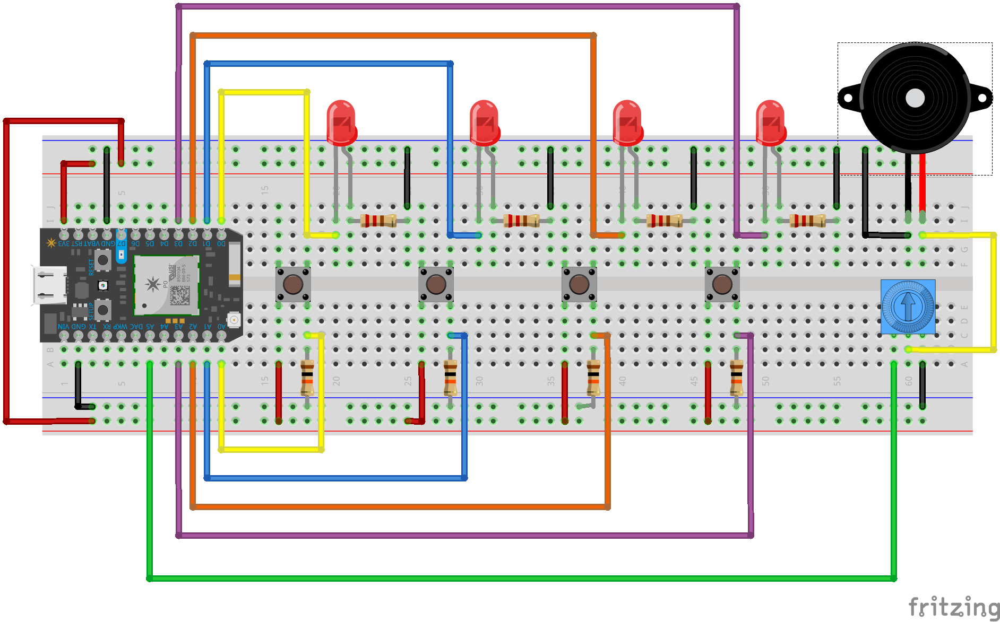

# Sequencer

This particular instrument allows a player to build a 4 beat rhythm out of dynamic pitches.



-----

### Code

```c
//This 4 beat sequencer has adjustable pitch! Hold down the buttons to raise the pitch of the associated beat.

//buzzer connection
int buzzerPin = A5;

//led connections
int led0 = D0;
int led1 = D1;
int led2 = D2;
int led3 = D3;

//button connections
int button0 = A0;
int button1 = A1;
int button2 = A2;
int button3 = A3;

//store the pitch each beat should play, these are the first notes that will be played
int pitch0 = 200;
int pitch1 = 200;
int pitch2 = 200;
int pitch3 = 200;

//store the tempo
int noteDuration = 500;
int restDuration = 250;

void setup() {

  // choose pin orientation
  pinMode(button0, INPUT);
  pinMode(button1, INPUT);
  pinMode(button2, INPUT);
  pinMode(button3, INPUT);

  pinMode(led0, OUTPUT);
  pinMode(led1, OUTPUT);
  pinMode(led2, OUTPUT);
  pinMode(led3, OUTPUT);
  
  pinMode(buzzerPin, OUTPUT);

}

void loop() {
  //check buttons
  int button0Reading = digitalRead(button0);
  int button1Reading = digitalRead(button1);
  int button2Reading = digitalRead(button2);
  int button3Reading = digitalRead(button3);

   //increase pitch if button is pressed
  if (button0Reading == HIGH) {
    pitch0 = pitch0 + 50;
  }

  else if (button1Reading == HIGH) {
    pitch1 = pitch1 + 50;
  }

  else if (button2Reading == HIGH) {
    pitch2 = pitch2 + 50;
  }

  else if (button3Reading == HIGH) {
    pitch3 = pitch3 + 50;
  }
  
  
  //play beat 0 and light up LED 0
  tone(buzzerPin, pitch0);
  digitalWrite(led0, HIGH);
  delay(noteDuration);
  
  //rest
  noTone(buzzerPin);
  digitalWrite(led0, LOW);
  delay(restDuration);

  //play beat 1 amd light up LED 1
  tone(buzzerPin, pitch1);
  digitalWrite(led1, HIGH);
  delay(noteDuration);
  
  //rest
  noTone(buzzerPin);
  digitalWrite(led1, LOW);
  delay(restDuration);

  //play beat 2 and light up LED 2
  tone(buzzerPin, pitch2);
  digitalWrite(led2, HIGH);
  delay(noteDuration);
  
  //rest
  noTone(buzzerPin);
  digitalWrite(led2, LOW);
  delay(restDuration);

  //play beat 3 and light up LED 3
  tone(buzzerPin, pitch3);
  digitalWrite(led3, HIGH);
  delay(noteDuration);
  
  //rest
  noTone(buzzerPin);
  digitalWrite(led3, LOW);
  delay(restDuration);

}
```
