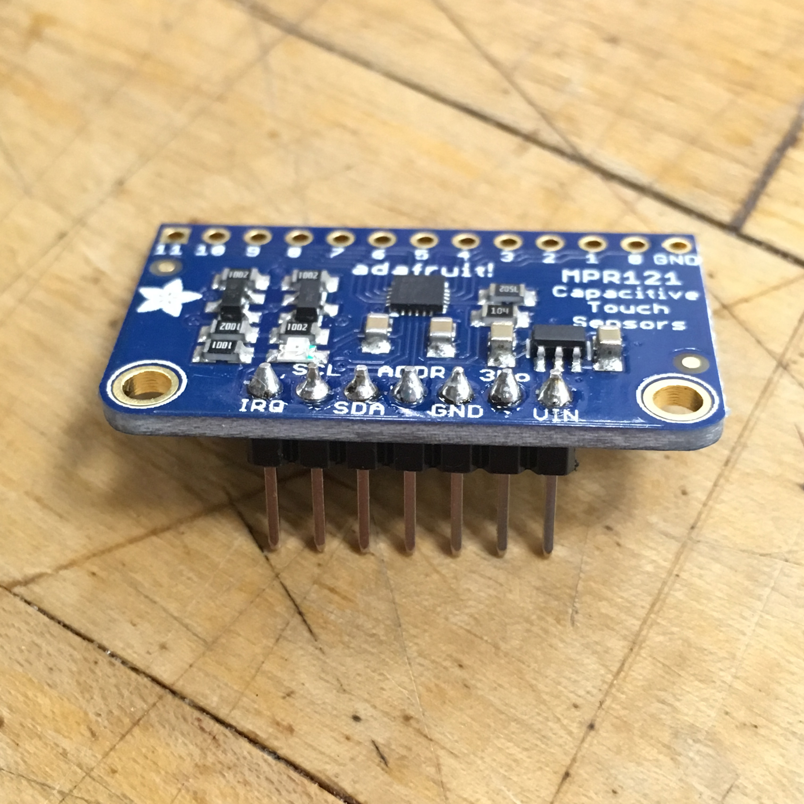
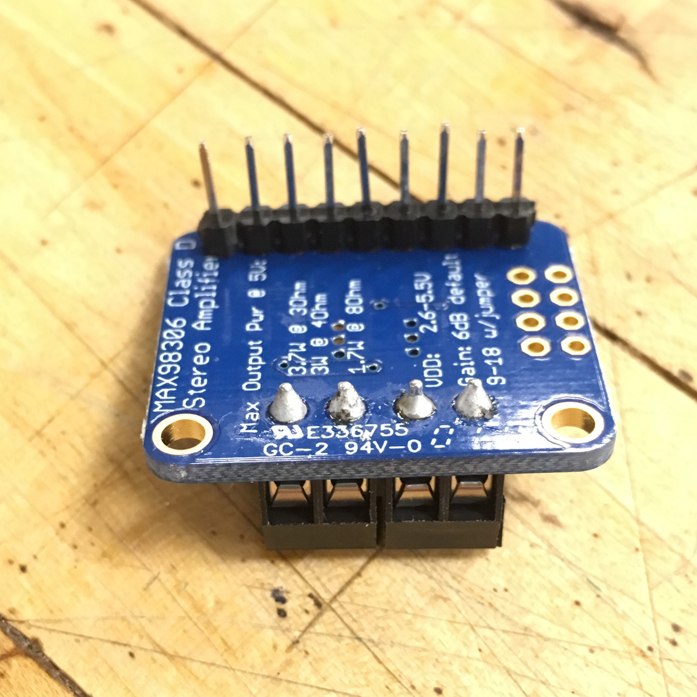
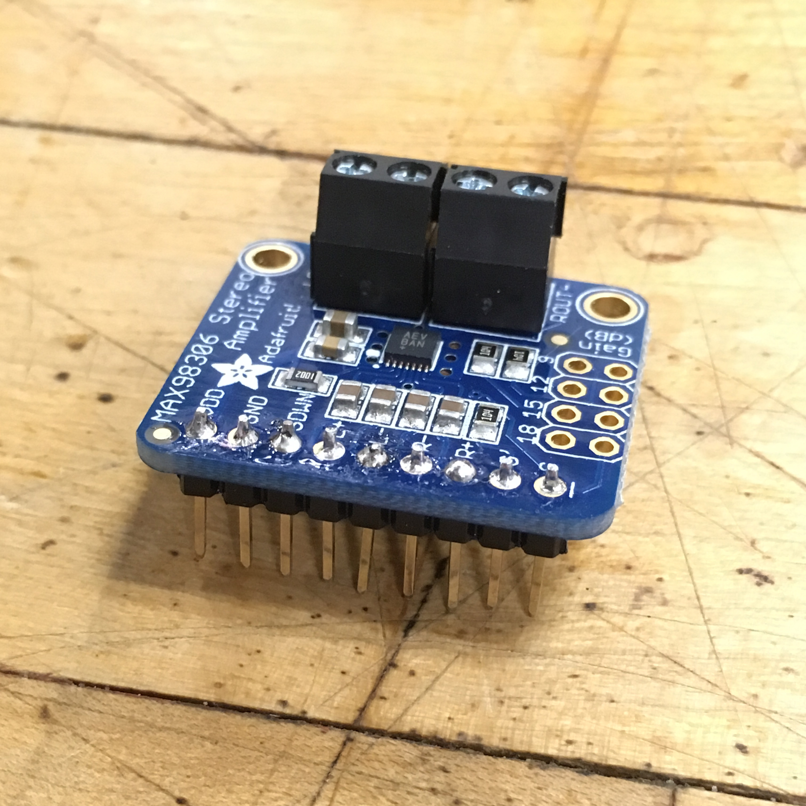
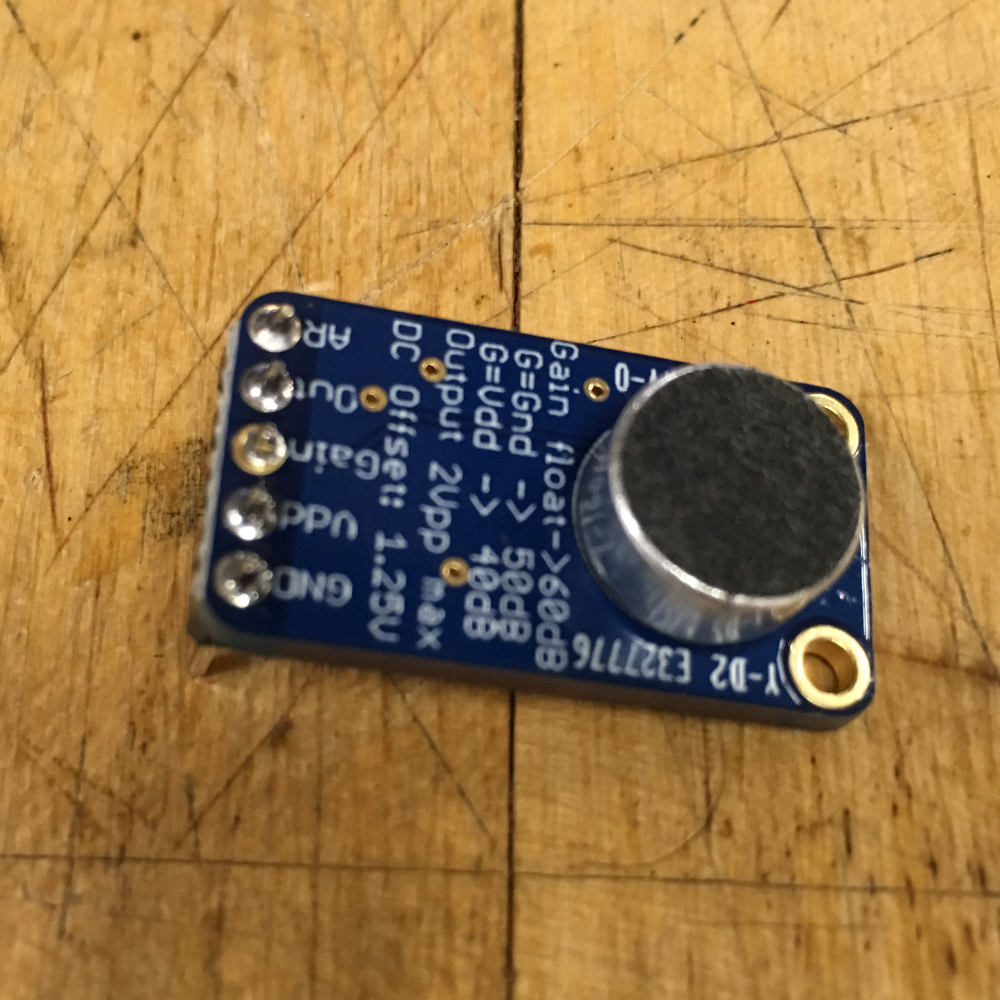
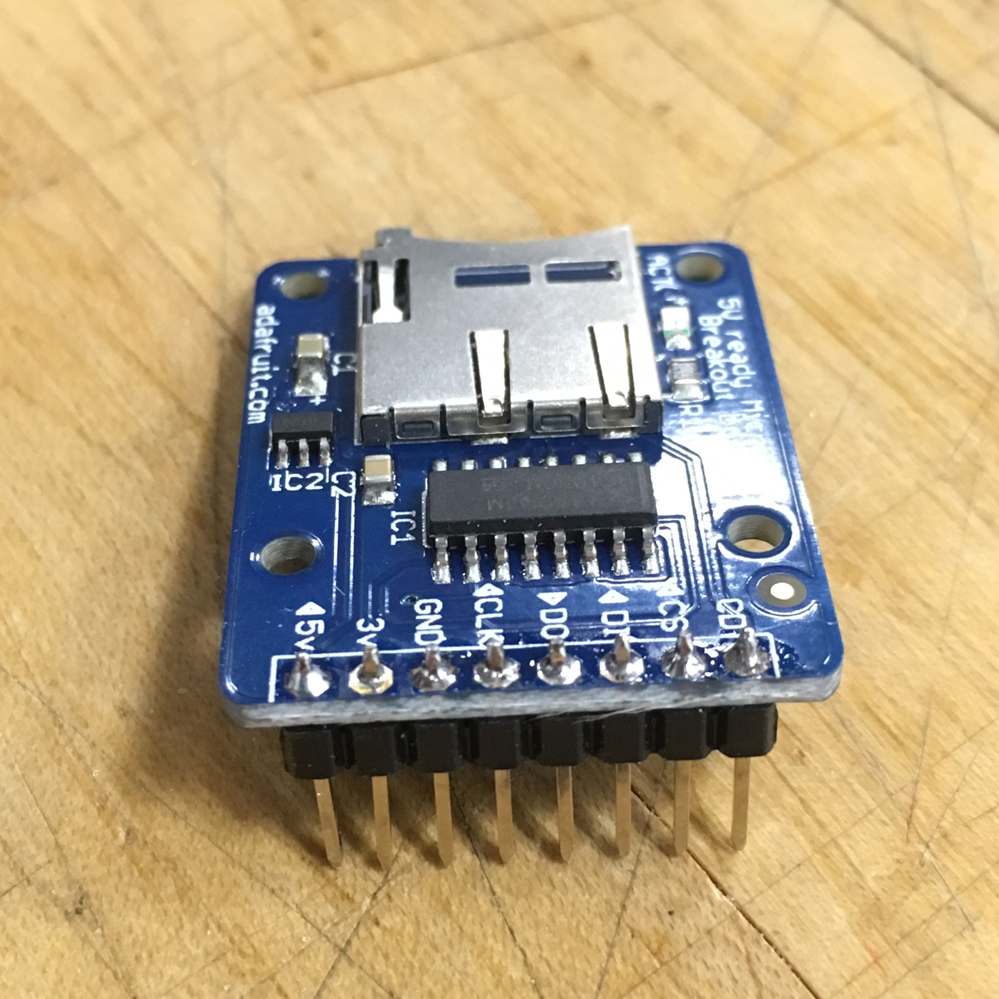

# Week 6 · New Skills

Let's spend the week learning a few skills adjacent to our main electronics and work, and then build a music making tool on our own!

---

- [Download Fritzing](http://fritzing.org)
- [Soldering Video](https://www.youtube.com/watch?v=Qps9woUGkvI)

-----

- Make a [Tone Generator](exercise.md).

-----

- Recommended Review: Rewire your [sequencer](../week03/README.md) and experiment with it. Lay down some tracks!

- Homework: Make a Fritzing diagram of your tone generator *as you wired it*. It doesn't need to look like mine! Submit diagram to BB.
- Homework: Record a track with your Tone Generator. Look out for audio cables on your desks on Friday. Submit recording to BB.
- Homework: Listen to three albums *all the way through*, all available on Spotify. Donna Summer's *I Remember Yesterday*, Vangelis *Albedo 0.39*, and Daft Punk's *Human After All*. Make sure you have an opinion on these!
- Homework: Email me a single track by an electronic musician *before next class* that you want the class to listen to.
- Homework: Solder male->male headers onto all of your new parts

  - Capacitive Touch Sensor
  

  - Stereo Amplifier
  
  

  - Microphone with Preamp
  
  
  - Micro SD Card Reader
  
