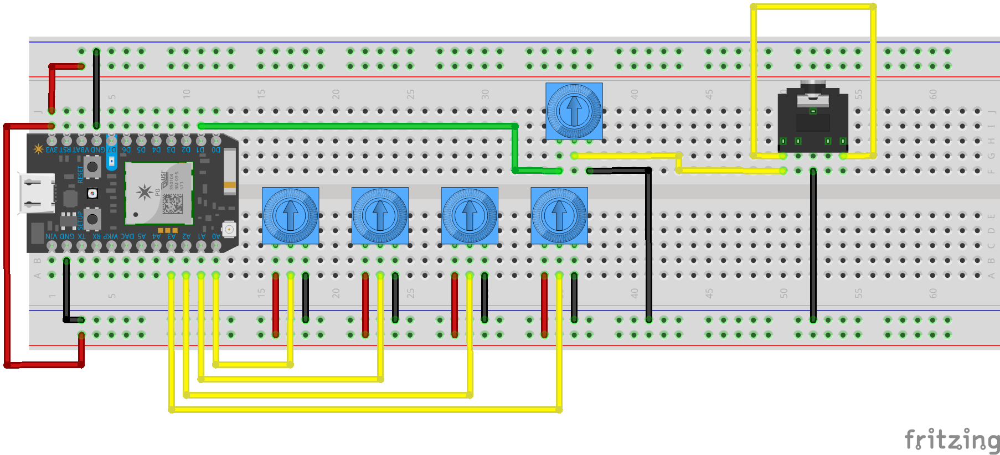

# Tone Generator

This particular project allows us to better understand low fidelity polyphony by building a tool capable of generating a controllable tone. We will also explore more advanced control structures in code.

Let's begin this exercise by wiring up a model, and then take a stab on our own at the code that would be required to make it operational.

The top trimpot handles volume. The other four trimpots are up to you — what might we want to control to make this a *pleasant* and useable instrument?



-----

### 3.5mm Stereo Headphone Jack (aka TRS Connector, Minijack, Audiojack...)


These connectors go by many names, but they are straightforward components that let us leave our buzzers behind and make our musical experiments more tolerable to the people in our environments! 

Plug in headphones for a private audio experience. Plug in an audio cable for high fidelity recording.

We can treat these components exactly like we do piezo buzzers, but each **outer leg** controls one ear of a pair of headphones. The **middle leg** gets wired to ground. The inner left and right legs can be used to tell if headphones are plugged in or not (and are not particularly useful for our purposes).

-----

### Code

Let's introduce some control structures.

A `for` loop allows for controlled and iterative looping over a chunk of code.

```c
//start looping with a counter set to 200
//keep looping so long as the counter is less than 1200
//after every loop, add 1 to i
for( int i = 200; i < 1200; i++ ){
  tone(D1, i);
  delay(5);
}
```

Another example, this one counts *down* rather than up.
```c
//start looping with a counter set to 1200
//keep looping so long as the counter is greater than 0
//after every loop, subtract 1 from i
for( int i = 1200; i > 0; i-- ){
  tone(D1, i);
  delay(5);
}

```

A `while` loop allows for a simpler controls: a loop that will continue indefinitely until some condition is fulfilled.

```c
//add a starting point for the note we want to play.
int pitch = 0;

//loop so long as our pitch is less than 1200
while( pitch < 1200 ){
  //add a random amount to pitch each loop
  pitch = pitch + random(0,100);

  //make noise
  tone(D1, pitch);
  delay(5);

}
```
