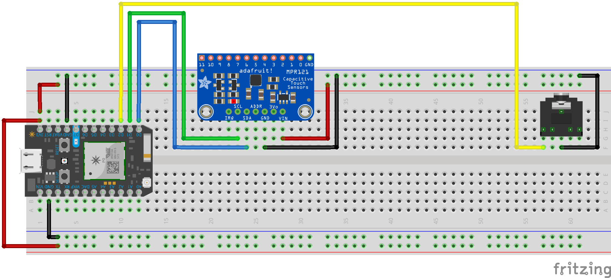

# Sampler

This project allows us to explore new instumentation interaction models. In particular, we'll see a computational understanding of human touch and the ability to detect minimally conductive objects can enable new kinds of musicality.

We'll rely on the code prepared for us by Adafruit, the maker of the capacitive touch board, so we can focus on the interactions.

This project is very much inspired by the [Ototo synth by Yuri Suzuki](http://yurisuzuki.com/artist/ototo).



-----

### MPR121 Capacitive Touch Sensor


This sensor allows us to use the *capacitance* of an object — the ratio between the amount of potential electic charge a body can carry to its perceived electrical charge — to trigger microcontroller actions. The human body is a capacitive object, and [so we can sense touch](https://en.wikipedia.org/wiki/Capacitive_sensing)! But, we can also sense fruit, water, copper tape or wire, conductive thread and ink... experiment! You can read more about this super flexible sensor, which makes room for 12 individual sensor pads, on [Adafruit's tutorial pages](https://learn.adafruit.com/adafruit-mpr121-12-key-capacitive-touch-sensor-breakout-tutorial).

This particular sensor uses the [I2C digital communication standard](https://learn.sparkfun.com/tutorials/i2c), common to hobbyist digital sensors. I2C, short for "inter-integrated circuits" and pronounced "eye-squared-sea," was invented in 1982 to aid in the digital communication between a fast 'master' device and many slower attached 'slave' devices — solving the timing problems exhibited by its competitor standard, SPI (to be discussed later).

It is an easy to implement standard that uses pins labels `SDA` and `SCL` for all communication. `SDA` carries the *da*ta between master and slave, and `SCL` keeps the *cl*ock of those transfers, so that each can speak and listen at the right times. On our Particle Photons, `SDA` is pin `D0` and `SCL` is pin `D1`, as is visible in our pinout diagram.


-----

### Code

Let's review the control structures from last week. We will be using code from the Photon library repository for this sensor today.

A `for` loop allows for controlled and iterative looping over a chunk of code.

```c
//start looping with a counter set to 200
//keep looping so long as the counter is less than 1200
//after every loop, add 1 to i
for( int i = 200; i < 1200; i++ ){
  tone(D1, i);
  delay(5);
}
```

Another example, this one counts *down* rather than up.
```c
//start looping with a counter set to 1200
//keep looping so long as the counter is greater than 0
//after every loop, subtract 1 from i
for( int i = 1200; i > 0; i-- ){
  tone(D1, i);
  delay(5);
}

```

A `while` loop allows for a simpler controls: a loop that will continue indefinitely until some condition is fulfilled.

```c
//add a starting point for the note we want to play.
int pitch = 0;

//loop so long as our pitch is less than 1200
while( pitch < 1200 ){
  //add a random amount to pitch each loop
  pitch = pitch + random(0,100);

  //make noise
  tone(D1, pitch);
  delay(5);

}
```

From the MPR121 library examples... make sure you import the libraries into your code! 

```c
/*********************************************************
This is a library for the MPR121 12-channel Capacitive touch sensor

Designed specifically to work with the MPR121 Breakout in the Adafruit shop 
  ----> https://www.adafruit.com/products/

These sensors use I2C communicate, at least 2 pins are required 
to interface

Adafruit invests time and resources providing this open source code, 
please support Adafruit and open-source hardware by purchasing 
products from Adafruit!

Written by Limor Fried/Ladyada for Adafruit Industries.  
BSD license, all text above must be included in any redistribution
**********************************************************/

#if defined(PARTICLE)
#include "Particle.h"
#else
#include <Wire.h>
#endif
#include "Adafruit_MPR121.h"

// You can have up to 4 on one i2c bus but one is enough for testing!
Adafruit_MPR121 cap = Adafruit_MPR121();

// Keeps track of the last pins touched
// so we know when buttons are 'released'
uint16_t lasttouched = 0;
uint16_t currtouched = 0;

void setup() {
  #if !defined(PARTICLE)
  while (!Serial);        // needed to keep leonardo/micro from starting too fast!
  #endif

  Serial.begin(9600);
  Serial.println("Adafruit MPR121 Capacitive Touch sensor test"); 
  
  // Default address is 0x5A, if tied to 3.3V its 0x5B
  // If tied to SDA its 0x5C and if SCL then 0x5D
  if (!cap.begin(0x5A)) {
    Serial.println("MPR121 not found, check wiring?");
    while (1)
    {
      #if defined(PARTICLE)
      Particle.process();
      #endif
    } 
    
  }
  Serial.println("MPR121 found!");
}

void loop() {
  // Get the currently touched pads
  currtouched = cap.touched();
  
  for (uint8_t i=0; i<12; i++) {
    // it if *is* touched and *wasnt* touched before, alert!
    if ((currtouched & _BV(i)) && !(lasttouched & _BV(i)) ) {
      Serial.print(i); Serial.println(" touched");
    }
    // if it *was* touched and now *isnt*, alert!
    if (!(currtouched & _BV(i)) && (lasttouched & _BV(i)) ) {
      Serial.print(i); Serial.println(" released");
    }
  }

  // reset our state
  lasttouched = currtouched;

  // comment out this line for detailed data from the sensor!
  return;
  
  // debugging info, what
  Serial.print("\t\t\t\t\t\t\t\t\t\t\t\t\t 0x"); Serial.println(cap.touched(), HEX);
  Serial.print("Filt: ");
  for (uint8_t i=0; i<12; i++) {
    Serial.print(cap.filteredData(i)); Serial.print("\t");
  }
  Serial.println();
  Serial.print("Base: ");
  for (uint8_t i=0; i<12; i++) {
    Serial.print(cap.baselineData(i)); Serial.print("\t");
  }
  Serial.println();
  
  // put a delay so it isn't overwhelming
  delay(100);
}

```