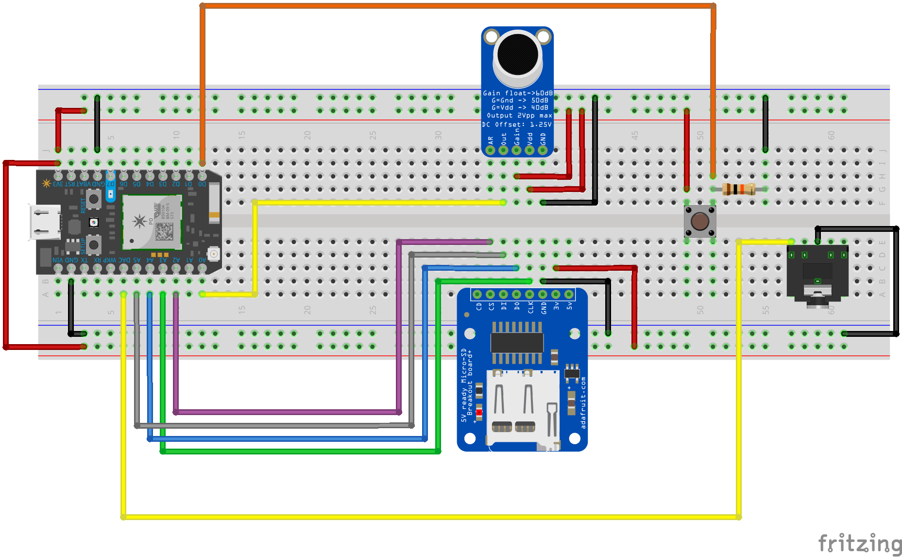

# Real Waveforms and SPI Interfaces

So far, we've used a simplifying tool to create audio waveforms -- the `tone()` function, which generates simple square waves with a frequency measured in hertz. This has been fine so far, but has largely prevented us from playing with an entire dimension of sound: volume!

In addition to generating some tones, let's also add in a new component interface: SPI.



-----

### SD Card Reader


This SPI protocol board, short for [Serial Peripheral Interface](https://en.wikipedia.org/wiki/Serial_Peripheral_Interface_Bus), allows the Photon to have access to more memory and write non-volatile data. SPI sensors and actuators are very common, far more common than its younger competitor, I2C.

SPI uses four wires, in addition to power and ground, to communicate between a master and slave. SPI is very verbose and precise, and requires a separate channel for each component in the system. The pins that drive SPI communication are named Master-In-Slave-Out (MISO), Master-Out-Slave-In (MOSI), Standard/Serial Clock (SCK), and Slave Select (SS). The SS pin is only used when multiple slave devices are attached to the same master.

The Photon has several SPI-compatible blocks of pins, though normally A2-A5 are used. Consult the Particle Photon pinout for other options.

- A2 -> SS
- AD -> SCK
- MISO -> A4
- MOSI -> A5

If it's not obvious, use an I2C component when you can! SPI steals more pins, and is generally more complicated to get working and debug.

-----

### Code

Make sure to import the `SdFat` Library for this code to compile. After set-up and opening a file, writing to an sd card is just like printing over `Serial`.

```c
//simple sd card write

#include "SdFat.h"

// Pick an SPI configuration.
#define SPI_CONFIGURATION 0

SdFat sd;
const uint8_t chipSelect = SS;

File myFile;

void setup() {

    if (!sd.begin(chipSelect, SPI_HALF_SPEED)) {
    sd.initErrorHalt();
  }

  // open the file for write at end like the "Native SD library"
  if (!myFile.open("test.txt", O_RDWR | O_CREAT | O_AT_END)) {
    sd.errorHalt("opening test.txt for write failed");
  }
  // if the file opened okay, write to it:
  myFile.println("Hello! The write worked!");

  // close the file:
  myFile.close();
}

void loop() {
  // nothing happens after setup
}

```

We can also use the Digital to Analog Converter on our Photon to make more interesting waveforms.

```c
//simple DAC sawtooth wave demo

int pin = DAC1;

void setup() {
    pinMode(pin, OUTPUT);
}

void loop() {
sawtooth(pin,100,200);
analogWrite(pin,0);
}


void sawtooth(int pin, int volume, int hertz) {
        for(int i = 0; i < volume; i++){
            analogWrite(pin, i);
            delay(1/(hertz/2));
            analogWrite(pin, 0);
            delay(1/(hertz/2));
        }
}

```