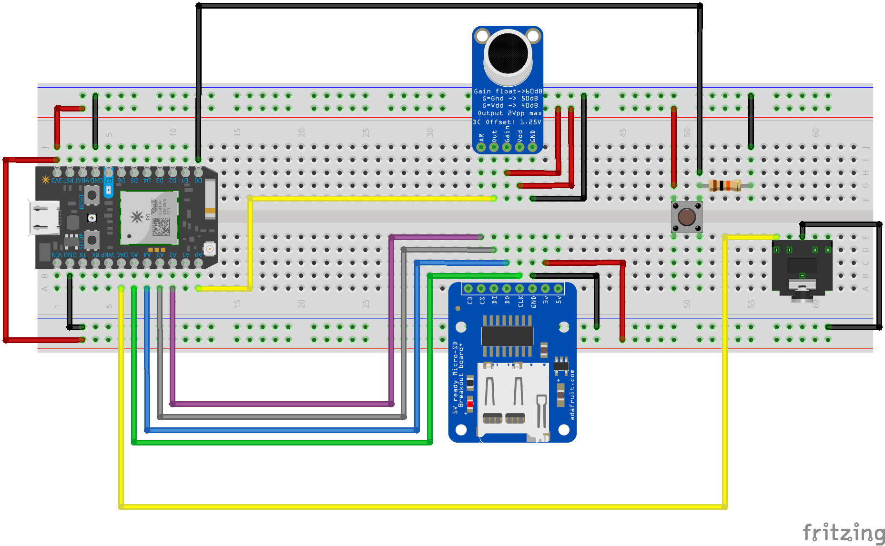

# Sampled Audio File Playback Device

Let's convert an audio file to raw amplitude samples, and then playback those samples.



Alternatively, download some [examples](example.md).

-----

### Code

Make sure to import the `SdFat` Library for this code to compile. After set-up and opening a file, writing to an sd card is just like printing over `Serial`. Reading is similarly straighforward.

Check out the documentation for the library [here](https://github.com/greiman/SdFat-Particle). There are many code samples as well as discussions on common use cases.

This is the baseline code for reading, as well as writing, commented out.

```c
#include "SdFat.h"

SdFat sd;
const uint8_t chipSelect = SS;

File myFile;

void setup() {
  Serial.begin(9600);
  // Wait for USB Serial 
  while (!Serial) {
    SysCall::yield();
  }
  
  // Initialize SdFat or print a detailed error message and halt
  // Use half speed like the native library.
  // Change to SPI_FULL_SPEED for more performance.
  if (!sd.begin(chipSelect, SPI_HALF_SPEED)) {
    sd.initErrorHalt();
  }

//  This is code for writing
//   // this opens a file for editing, makes the file if it doesn't exist, and places our imaginary text cursor at the end.
//   if (!myFile.open("test.txt", O_RDWR | O_CREAT | O_AT_END)) {
//     //prints an error if for some reason the file couldn't be written
//     sd.errorHalt("opening test.txt for write failed");
//   }
//   // if the file opened okay, write to it:
//   Serial.print("Writing to test.txt...");
//   myFile.println("hello world!");

//   // close the file:
//   myFile.close();
//   Serial.println("done.");


  // This is code for reading
  // Open the file for reading:
  if (!myFile.open("test.txt", O_READ)) {
    sd.errorHalt("opening test.txt for read failed");
  }
  Serial.println("test.txt content:");

  // read from the file until there's nothing else in it:
  int data;
  
  //myFile.read() returns -1 when there is nothing left on the card...
  while ((data = myFile.read()) >= 0) {
    Serial.write(data);
  }
  // close the file:
  myFile.close();

}

void loop() {
  // nothing happens after setup
}

```

-----

More advanced code allows us to read a stream of data and operate on it. 

```c
// This #include statement was automatically added by the Particle IDE.
#include <SdFat.h>

int pin = DAC1;
int button = D1;

SdFat sd;
const uint8_t chipSelect = SS;

File myFile;

void setup() {
    //set pinmodes
    pinMode(pin,OUTPUT);
    pinMode(button,INPUT);
    
    Serial.begin(9600);
     // Wait for USB Serial 
    while (!Serial) {
        SysCall::yield();
    }
}

void loop() {
    //check for button press
    int buttonState = digitalRead(D1);

    if(buttonState == HIGH){
        playAudioFile("aerodynamic_raw.h");
    }
}

//function for playback
void playAudioFile(String filename){

     // Initialize SdFat or print a detailed error message and halt
  if (!sd.begin(chipSelect, SPI_HALF_SPEED)) {
    sd.initErrorHalt();
  }

  // open the file for reading:
  if (!myFile.open(filename, O_READ)) {
    sd.errorHalt("opening test.txt for read failed");
  }

  // variable to hold read data
  int data;
  
  //while there remains stuff in the file to read
  while ((data = myFile.read()) >= 0) {
    //make a string container for the contents of the audio files, and stop whenever we hit a comma
    String list = myFile.readStringUntil(',');
    
    //convert the string to an integer and rename it
    int amplitude = list.toInt();
    
    //send the voltage to the headphone jack
    analogWrite(pin, amplitude);

    //wait, experiment with the timing!
    delayMicroseconds(20);
  }
  
  // close the file:
  myFile.close();
    
}
```

