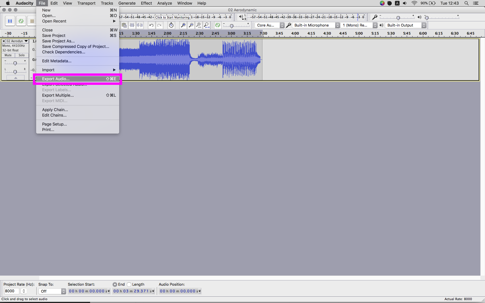

# Preparing Audio Files

After downloading and installing [Audacity](http://audacity.sourceforge.net), let's consider [wav2c](https://github.com/olleolleolle/wav2c), which we will need to compile ourselves. 

At the GitHub page for the `wav2c` project, click on the 'Clone or download' button, and then 'Download ZIP'. Unzip the contents.

-----

### Compiling Wav2C

Open up the Terminal application on Mac or Linux systems, or install and run [Cygwin](https://www.cygwin.com) on Windows.

Place the downloaded `wav2c-master` folder on your desktop, and in your Terminal, type

```
cd ~/Desktop/wav2c-master/
```

You can press `tab` to autocomplete as your type. If you type in `ls` you should see a list of files likes this:

```

LICENSE   Makefile  README.markdown main.c    wavdata.c wavdata.h

```

To compile the binary file, we can now type in...

```
make
```

This will produce a bunch of lines of text, telling you new files were created.

```
gcc -c main.c
gcc -c wavdata.c
gcc main.o wavdata.o -o wav2c
```

Let's make sure we can execute this program.

```
chmod +x wav2c
```

And, finally, move it into the place where your system will look for it by default.

```
mv wav2c /usr/local/bin/
```

### Audacity Conversion

Audacity allows us to take an MP3, and export it for embedded electronic device use like our Photons. The settings are very specific, and need to be matched exactly.

1. `File -> Open` to import your MP3 file.

2. Click on the Track in the scrubber region.
3. `Tracks -> Stereo Tracks to Mono` to combine the right and left channels.

4. Change the `Project Rate (Hz)` in the bottom-left hand corner of the window to `8000`
  
5. `File -> Export Audio`

6. For `Format` select any `other uncompressed file`

7. Click on the `Options` button and choose `Header -> WAV (Microsoft)` and `Encoding -> Unsigned 8 Bit PCM`

8. Make sure the file is being saved to your Desktop. Hit `OK` and then `Save`.
9. The metadata window will open, you can edit whatever you want, or just hit `OK`.


We've now produced a `.wav` file of our MP3, but we need to convert it into a list of amplitude values.

Back in Terminal, type the following.

```
cd ~/Desktop
``` 

This will move your Terminal window's focus to your desktop, and finally.

```
wav2c nameOfSong.wav nameOfSong.h samples
```

`nameOfSong.h` is whatever you want to call the resulting file. It will include a variable inside, called whatever you specified for `samples`.

If you open the file in a text editor like [Sublime](https://www.sublimetext.com), you should see something like the following, in a very long file.

```c
// sounddata sound made by wav2c

// const int samples_sampleRate = 8000;
const int samples_length = 15648;

const signed char samples[] PROGMEM ={111, 
86, 86, 94, 103, 110, 109, 116, 108, 111, 113, 117, 123, 135, 138, 139, 134, 134, 134, 134, 140, 
142, 148, 146, 139, 140, 138, 132, 140, 138, 135, 140, 133, 129, 123, 126, 125, 123, 128, 129, 128, 
127, 130, 121, 128, 133, 126, 131, 137, 134, 140, 139, 140, 142, 141, 149, 142, 151, 149, 150, 155, 
152, 150, 154, 151, 140, 146, 159, 156, 154, 157, 140, 130, 127, 128, 124, 131, 135, 121, 123, 116, 
103, 102, 101, 100, 101, 108, 110, 104, 104, 94, 90, 96, 95, 99, 107, 116, 113, 114, 109, 104, 
107, 112, 115, 120, 128, 126, 125, 123, 122, 118, 124, 125, 126, 131, 134, 136, 129, 129, 125, 122, 
122, 124, 128, 131, 133, 131, 128, 130, 133, 130, 126, 125, 132, 134, 135, 138, 135, 138, 134, 131, 
134, 133, 128, 128, 141, 146, 134, 141, 149, 127, 124, 134, 131, 127, 133, 140, 139, 122, 119, 120, 
110, 99, 99, 112, 104, 100, 112, 115, 98, 94, 97, 99, 100, 105, 113, 113, 122, 121, 133, 124, 
96, 107, 124, 94, 64, 94, 90, 72, 74, 106, 128, 143, 128, 99, 128, 145, 154, 137, 136, 125, 
104, 93, 99, 112, 113, 116, 115, 102, 97, 144, 168, 134, 110, 138, 137, 122, 131, 140, 120, 123, 
142, 147, 141, 143, 153, 139, 139, 135, 149, 152, 137, 127, 116, 109, 139, 159, 148, 132, 141, 159, 
119, 81, 88, 116, 109, 93, 99, 119, 119, 101, 97, 102, 113, 124, 120, 90, 78, 91, 112, 106, 
100, 106, 101, 102, 99, 97, 104, 143, 166, 138, 111, 134, 141, 111, 125, 137, 113, 93, 133, 150, 
110, 111, 165, 177, 114, 85, 136, 171, 143, 121, 125, 143, 148, 136, 113, 111, 145, 128, 86, 71, 
101, 128, 106, 98, 118, 128, 114, 132, 138, 132, 144, 172, 173, 137, 112, 119, 125, 111, 105, 108,
...
```

Congrats! 

-----

### Version 1 : A Few Changes

You should see a line that looks like this...

```
const signed char samples[] PROGMEM ={111, 
```

Get rid of and change a few things for Photon compatibility...

```
const int samples[] ={111, 
```

That's it! *Files edited in this way can be sent directly to your Photon's RAM in the web IDE.*

### Version 2 : Just the Numbers

Make a duplicate of the file, and remove everything at the top before the first value. Also, jump to the bottom of the file and remove the closing `};`.

*These are the kinds of files we want to use on an SD card.*
