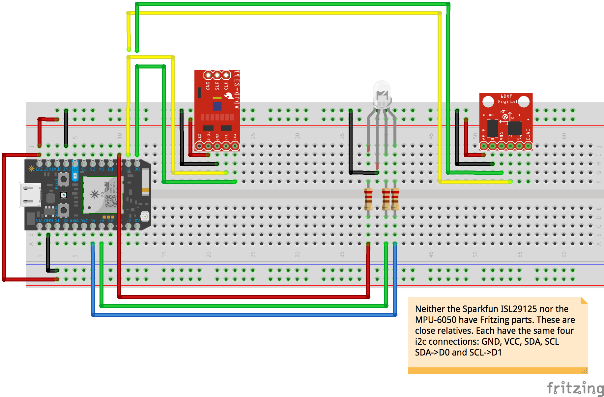

# Sensor Array

Let's see what some new sensors can report to us.

-----

### Color Sensor 

The [ISL29125](https://www.sparkfun.com/products/12829) is an affordable, easy to implement light wavelength sensor. It can measure not only the visible wavelengths of light, but also [into the ultraviolet and infrared](https://en.wikipedia.org/wiki/Electromagnetic_spectrum). Through a simple I2C library, the sensor returns values for the Red, Green, and Blue components of light. [Additional configuration commands](https://learn.sparkfun.com/tutorials/isl29125-rgb-light-sensor-hookup-guide) allows more precise wavelength measurement.

### GY-521 MPU 6050 6 Degees of Freedom Sensor (Accelerometer and Gyroscope)

The MPU-6050 is an easy to implement inertial measurement unit or [IMU](https://www.sparkfun.com/pages/accel_gyro_guide). It is capable of measuring both linear and rotational acceleration in all three dimensions, and [with hard math](https://github.com/jrowberg/i2cdevlib/tree/master/Arduino/MPU6050/examples), our photons can derive from those measurements their 3-dimensional positions (usually notated in the [Euler Angles](https://www.sparkfun.com/pages/accel_gyro_guide) standard). More complex IMUs add a barometer (for elevation change) or magnetometer (for compass heading).

### Code

None this week! Go fly from the nest! 

Let's try to get these sensors working through online resources this week, and build up some confidence.