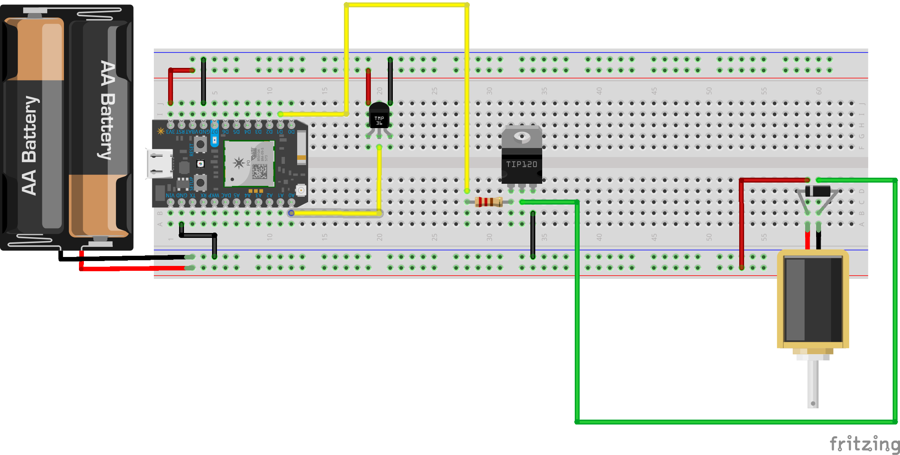

# Desktop Percussion

Let's see what some new sensors can report to us.



-----

### Solenoid 


[Solenoids](https://en.wikipedia.org/wiki/Solenoid) are simple electromagents. In a solenoid, a coil of wire surrounds a spring-loaded magnetic pin. When current flows through the wire, a magnetic field is induced. Depending on the number of twists of the coil, as well as the strength of the electrical current, the magnetic field can be manipulated or switched on/off by a transistor.

Solenoids draw a lot of power, and so we use a separate power supply and diode to prevent our Photon from being harmed. 

-----

### Darlington TIP-120 Transistor


Yup, the same ['transistor'](https://en.wikipedia.org/wiki/Transistor) as the ones that make up your [computer's processor](https://en.wikipedia.org/wiki/Central_processing_unit), just massively larger. A transistor is an electronic controlled switch with 3 pins, as well as an aluminum heatsink. The 3 pins are named, from left to right on Darlingtons: 'Base', 'Emmitter', 'Collector.' 

When power is applied to the *Base* leg, around .7 volts is required, a connection is opened up between the *Collector* and the *Emmitter* legs. This is how [all computers do everything](https://en.wikipedia.org/wiki/Logic_gate)! Implementing a transistor allows low voltage devices, like our Photon, to control high voltage or amperage devices like motors, pumps, and electromagnets without getting fried.


### TMP35 Analog Temperature Sensor


Simple, accurate, analog temperature sensor. It looks exactly like a transistor, though has the markings `TMP` on the back. It measures temperature based on voltage. The formula is...

```
degreesC = (mV - 500) / 10
degreesF = ((degreesC * 9) / 5) + 32
```

-----

### Code

The solenoid will just use `digitalWrite()`. Nothing new there.

The temperature sensor can potentially use some new, Particle-specific stuff.

```c
//declare a global variable
double temperatureC;

//function for converting TMP35 sensor readings
double tempC(int pin, String standard = "C"){
    int reading = analogRead(pin);
    double mV = (double(reading)*3300) / 4096;
    temperatureC = (mV - 500)/10;
        if(standard == "C"){
            return temperatureC;
        }
        else if (standard == "F"){
            double temperatureF = ((temperatureC * 9) / 5) + 32;
            return temperatureF;
        }
}


void setup() {
	pinMode(A0, INPUT);
	Serial.begin(9600);
	//make a variable available on the online console
	Particle.variable("temp", temperatureC);
}


void loop() {
    Serial.println(tempC(A0));
    delay(100);
}
```