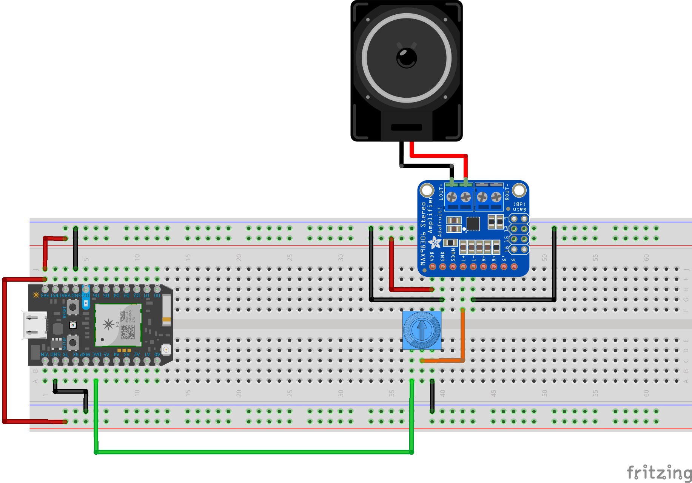
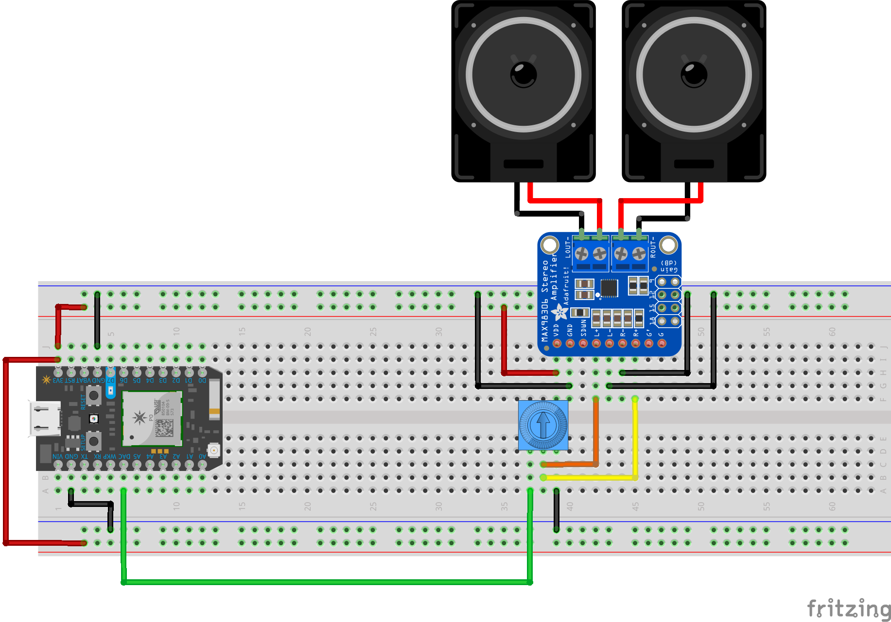

# Loudspeaker

Better quality sound, no more crackling.



-----

For later, you may want to play with a dual speaker setup.



-----

### Stereo 3.7W Audio Amplifier - MAX98306


[This amazingly powerful and simple amp](https://www.adafruit.com/product/987) takes an input PWM or Voltage-modulated signal, removes any high crackling or shrieking with on-board capacitors serving as a [low-pass filter](https://en.wikipedia.org/wiki/Low-pass_filter), and boosts the volume up to work with real speakers! Read more about what you can do with this thing in the [hook-up guide](https://learn.adafruit.com/stereo-3-7w-class-d-audio-amplifier/overview).

-----

### Code

The solenoid will just use `digitalWrite()`. Nothing new there.

The temperature sensor can potentially use some new, Particle-specific stuff.

```c
void setup() {
    pinMode(DAC1, OUTPUT);
}

void loop() {

    float scaleC[] = { 261.626, 293.665, 329.628, 349.228, 391.995, 440.000, 493.883, 523.251 };

    int j = 0;

    for(int i = 0; i < 8; i++){
        j = 0;
        while (j < scaleC[i] ){
            float hold = 1000000 / scaleC[i] ;
            int holdDuration = int(hold / 2);
            
            analogWrite(DAC1, 4095);
            delayMicroseconds(holdDuration);
            analogWrite(DAC1, 0);
            delayMicroseconds(holdDuration);
            j++;
        }
    }
}
```
